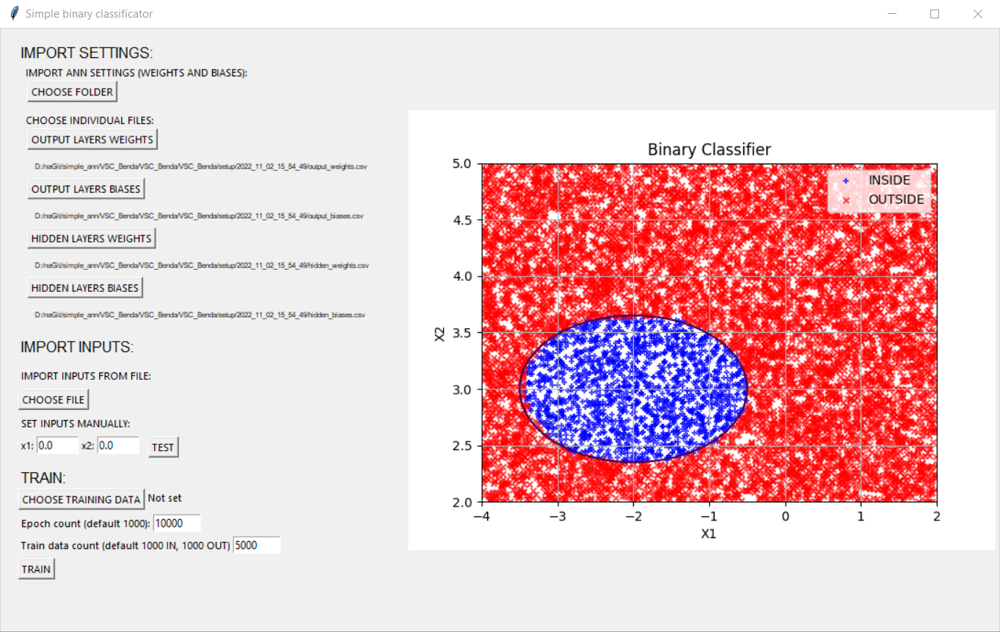
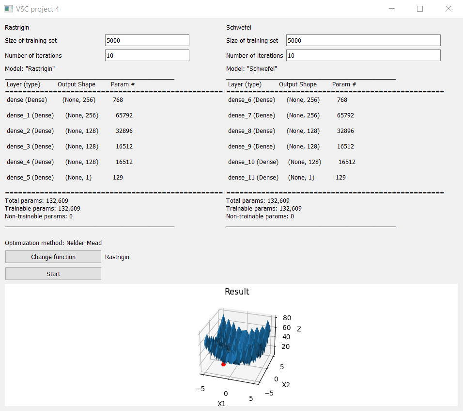

# VSC (Neural networks and Machine Learning)
### Course Description
The [course](https://www.fme.vutbr.cz/en/studenti/predmety/261173) introduces basic approaches to Machine Learning and Deep Learning and classical methods used in the field. Practical use of the methods is demonstrated on solving simple engineering problems.

### Projects
- Project 1 - ANN Clasifier
- Project 2 - Adaptive ANN model for function approximation

### Project 1 - ANN Clasifier
Simple ANN Clasifier. Inputs are coordinates of point x. Output is binary value True/False whether the point is inside or outside of defined ellipse.

Instead of using libraries for machine learning, simple ANN was created using Numpy library.

<figure>
    
    <figcaption>Simple ANN clasifier</figcaption>
</figure>

### Project 2 - Adaptive ANN model for function approximation
Adaptive ANN modelling for Rastrigin and Schwefel functions. Nelder-Mead Optimization was used. For this project, Keras API from Tensorflow framework was used.

<figure>
    
    <figcaption>Adaptive ANN model</figcaption>
</figure>